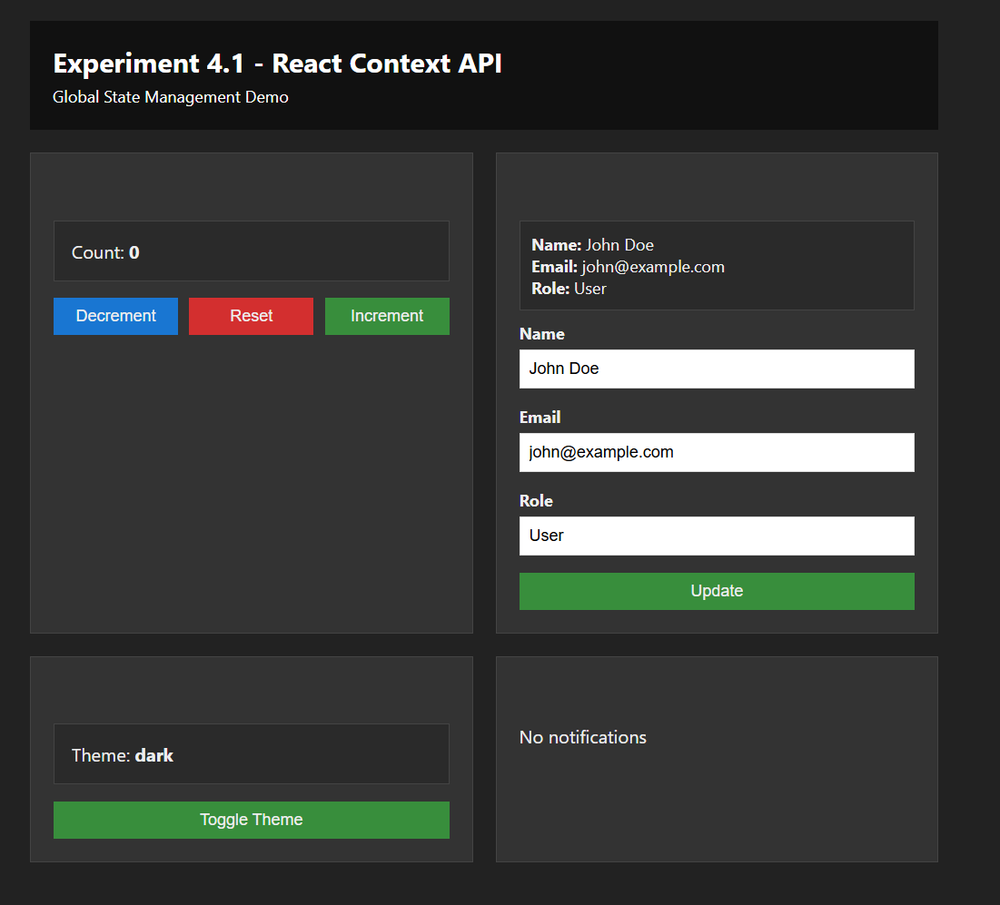

# Experiment 4.1 - Global State Management Using React Context API

## About

This experiment demonstrates global state management using React's Context API. It showcases how to create a context, provide it to the application, and consume it in multiple child components without prop drilling.

## Key Features

- **Global Context Setup**: Custom `GlobalContext` with `useContext` hook
- **State Management**: 
  - Theme (light/dark mode)
  - User profile information
  - Counter functionality
  - Notifications system
- **Multiple Consumers**: Demonstrates different components consuming and updating global state
- **Real-time Updates**: Changes in one component reflect across all consumers

## Project Structure

```
4.1/
├── src/
│   ├── context/
│   │   └── GlobalContext.jsx     # Context definition and provider
│   ├── components/
│   │   ├── Counter.jsx            # Counter component
│   │   ├── UserProfile.jsx        # User profile component
│   │   ├── ThemeToggle.jsx        # Theme switcher component
│   │   └── NotificationCenter.jsx # Notifications display
│   ├── App.jsx                    # Main app component
│   ├── App.css                    # Global styles
│   ├── main.jsx                   # Entry point
│   └── index.css                  # Base styles
├── index.html                     # HTML template
├── package.json                   # Dependencies
└── vite.config.js                 # Vite configuration
```

## How to Run

1. Install dependencies:
   ```bash
   npm install
   ```

2. Start development server:
   ```bash
   npm run dev
   ```

3. Open your browser and navigate to the provided local URL (usually `http://localhost:5173`)

## Learning Outcomes

- Understanding React Context API
- Creating and using Context providers
- Consuming context with `useContext` hook
- Managing global state without prop drilling
- Building scalable React applications

## Components Overview

### GlobalContext.jsx
Creates a context with global state including theme, user data, counter, and notifications.

### Counter.jsx
Demonstrates counter operations (increment, decrement, reset) updating global state.

### UserProfile.jsx
Shows how to read and update user information in global context.

### ThemeToggle.jsx
Implements theme switching functionality affecting the entire application.

### NotificationCenter.jsx
Displays notifications triggered by state changes showing real-time updates.

## Concepts Covered

✅ `createContext()` - Creating a context  
✅ Context Provider - Wrapping app with provider  
✅ `useContext()` hook - Consuming context in components  
✅ Global state management - Avoiding prop drilling  
✅ State updates across components - Synchronization  



